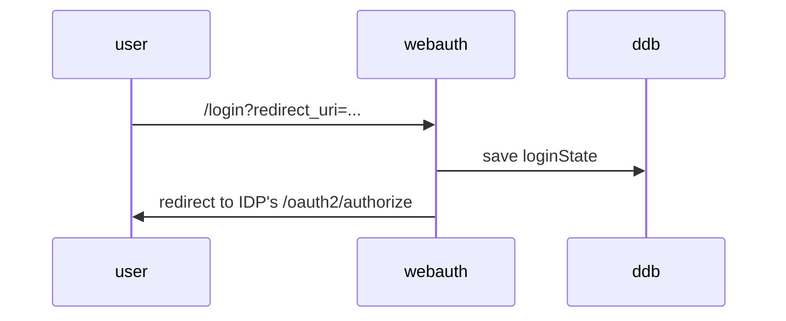

# Authentication for webapp
The *webauth* package provides a few Function URL handlers to perform authentication-related functionality for a webapp.

Specifically, it provides customisable implementation for these endpoints:
* `/login` which supports two types of requests: [initiate login](#initiate-login) and
[complete login](#complete-login).
* `/logout` which supports two types of requests as well: [initiate logout](#initiate-logout) and
[complete logout](#complete-logout).

In success cases, the handlers will always respond with a redirect (302), while in failure cases, a JSON response will
be returned. Because these Function URL handlers are intended to be used as a CloudFront origin, for a better customer
experience, a Lambda@Edge function can be used as a CloudFront origin-response to replace the error responses with a
more user-friendly HTML content. Additionally, library user may also customise the error responses to return HTML
content as well.

The library is written to work with AWS Cognito, but it can be generalised to work with any IDP.

## DynamoDB Tables
This section lists all the DynamoDB tables and their schemas that are used by `webauth` package.

### loginState
This table stores short-lived items representing login attempts. The items are created in
[initiate login](#initiate-login).

| name        | type    | usage                                                                            |
|-------------|---------|----------------------------------------------------------------------------------|
| id          | S (key) | the `state` query parameter sent to AWS Cognito                                  |
| nonce       | S       | the `nonce` query parameter sent to AWS Cognito                                  |
| redirectUri | S       | the validated `redirect_uri` query parameter from the original request to /login |
| sourceIp    | S       | source IP address of the original request to /login                              |
| userAgent   | S       | User-Agent of the original request to /login                                     |
| ttl         | N       | 30 minutes from timestamp of original request to /login                          |

### session
Items in this table last as long as a session should "last", and are created in [complete login](#complete-login).

| name      | type    | usage                                                                                                                                                           |
|-----------|---------|-----------------------------------------------------------------------------------------------------------------------------------------------------------------|
| id        | S (key) | session identifier                                                                                                                                              |
| host      | S       | scheme + host + port of the session. useful if the same table stores different sessions for different sites, e.g. https://mysite.com and https://localhost:3000 |
| sourceIp  | S       | source IP address of the original request to /login                                                                                                             |
| userAgent | S       | User-Agent of the original request to /login                                                                                                                    |
| ttl       | N       | as long as a session should last, recommended to be 24 hours                                                                                                    |
| ...       | ...     | any other fields that need to be stored with the session, such as user attributes (i.e. `sub`) from `id_token`                                                  |

### refreshToken
This table stores the `refresh_token` items; its TTL should be the smaller expiry of `access_token`, `id_token`, and
`refresh_token`. The item is created in [complete login](#complete-login) is used in two places:
[silent login](#silent-login) and [session refresh](#session-refresh).

| name         | type    | usage                                                                                                                                                           |
|--------------|---------|-----------------------------------------------------------------------------------------------------------------------------------------------------------------|
| id           | S (key) | session identifier                                                                                                                                              |
| refreshToken | S       | `refresh_token` from IDP                                                                                                                                        |
| host         | S       | scheme + host + port of the session. useful if the same table stores different sessions for different sites, e.g. https://mysite.com and https://localhost:3000 |
| sourceIp     | S       | source IP address of the original request to /login                                                                                                             |
| userAgent    | S       | User-Agent of the original request to /login                                                                                                                    |
| ttl          | N       | should be the smaller expiry time of `access_token`, `id_token`, or `refresh_token`                                                                             |
| ...          | ...     | additional fields required to perform further token exchange with AWS Cognito (client Id, secret, etc.)                                                         |

## Initiate Login

When a page needs the user to be authenticated, redirect to `/login`:
* `code` and `state` parameters cannot be given. The presence of both indicates a [complete login](#complete-login)
request instead. Providing one but not the other is an invalid request.
* `redirect_uri` can be given to indicate the page that customers will land on upon successful authentication.
  * If not given, default to homepage at `/`.
  * Can be a path starting with `/` and may any additional query string or hash fragment, e.g.
  `redirect_uri=/payments?day=2023-08-09`.
  * If given with a host and optional port, the scheme must also be given, and the full scheme + host must be explicitly
  allowlisted; e.g. `redirect_uri=https://localhost:3000/payments?day=2023-08-09` can be used to redirect login attempts
  to a local development server.

The item that will be written to `loginState` table has these attributes:
* `id`: cryptographically secure identifier. This will be the `state` query parameter sent to IDP's `/oauth2/authorize`.
* `sourceIp` and `userAgent` are optionally stored as well. If stored, once a session is established, only subsequent
usage with from the same IP address and User-Agent

### Silent Login

## Complete Login

## Initiate Logout

## Complete Logout

## Session refresh
